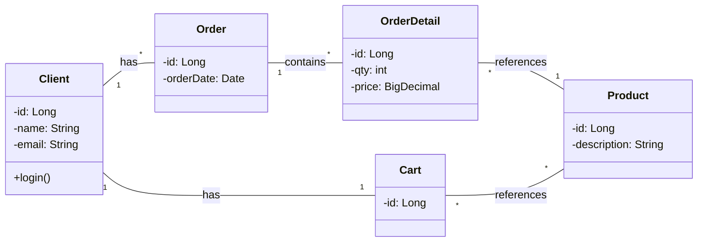

```mermaid
classDiagram
direction LR
    class Client {
        -id: Long
        -name: String
        -email: String
        
        +login()
    }

    class Order {
        -id: Long
        -orderDate: Date
        
    }

    class OrderDetail {
        -id: Long
        -qty: int
        -price: BigDecimal
    }

    class Product {
        -id: Long
        -description: String
    }
    
    class Cart {
        -id: Long
    }


    Client "1" -- "*" Order : has
    Order "1" -- "*" OrderDetail : contains
    OrderDetail "*" -- "1" Product : references
    Client "1" -- "1" Cart : has
    Cart "*" -- "*" Product : references
     
```